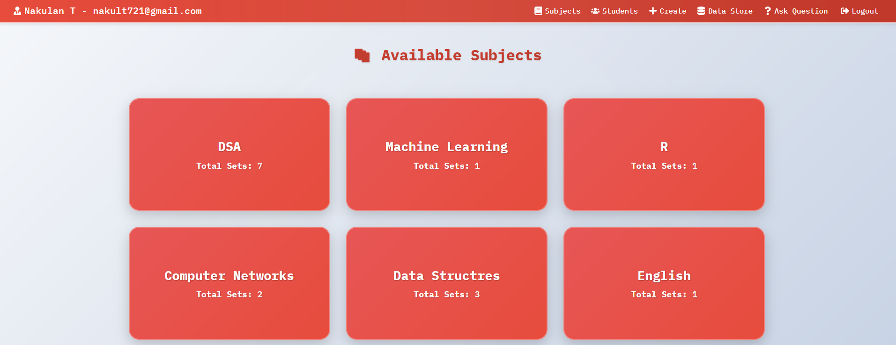

# AI-Powered EduRAG System

An innovative educational platform that leverages Retrieval-Augmented Generation (RAG) and advanced NLP techniques to enhance learning experiences. This system integrates a Flask-based backend with a React frontend, utilizing AI models like Gemini 2.0 and DeepSeek 1.5B, alongside ChromaDB for efficient document retrieval. It provides features like question generation, answering, user authentication, and subject-specific content management.

## Features

- **Document Storage & Retrieval**: Store educational content and retrieve relevant chunks using a ChromaDB-backed system with SentenceTransformer embeddings.
- **AI-Driven Q&A**: Generate answers to user queries using DeepSeek 1.5B and retrieve contextually relevant information with a 40% improvement in query retrieval efficiency.
- **Question Generation**: Automatically create question sets for subjects using the Gemini 2.0 API.
- **User Management**: Register and authenticate students and teachers with secure password hashing using Flask-Bcrypt.
- **Subject Management**: Organize and retrieve subject-specific question sets stored in JSON format.
- **Progress Tracking**: Track viewed question sets for students, providing insights into their learning progress.
- **Frontend Interface**: A responsive React-based frontend for seamless user interaction.

## Tech Stack

- **Backend**: Flask, Python, Flask-CORS, Flask-Bcrypt, Waitress
- **Frontend**: React
- **AI Models**: 
  - Gemini 2.0 API (Question Generation)
  - DeepSeek 1.5B (Answer Generation)
- **NLP Libraries**: SpaCy (Keyword Extraction), NLTK (Sentence Tokenization)
- **Database**: ChromaDB (Vector Storage), JSON Files (User & Subject Data)
- **Embeddings**: SentenceTransformer for efficient document search
- **APIs**: Ollama API for local model inference

## Project Structure

```
AI-Powered-EduRAG/
├── backend/
│   ├── app.py              # Main Flask application
│   ├── ollama_model.py     # Ollama model integration for answer generation
│   ├── Rag.py              # RAG system for storing and retrieving chunks
│   ├── api.py              # API integration for question generation
│   └── DB/                 # Directory for JSON data storage
│       ├── students.json   # Student data
│       ├── staffs.json     # Teacher data
│       └── subjects/       # Subject-specific question sets
├── frontend/               # React frontend code (assumed)
└── README.md               # Project documentation
```

## Setup Instructions

### Prerequisites
- Python 3.8+
- Node.js (for React frontend)
- Ollama running locally (for DeepSeek 1.5B inference)
- ChromaDB installed and configured
- API keys for Gemini 2.0 (if applicable)

### Backend Setup
1. **Clone the Repository**:
   ```bash
   git clone <repository-url>
   cd AI-Powered-EduRAG/backend
   ```

2. **Install Dependencies**:
   ```bash
   pip install flask flask-cors flask-bcrypt requests nltk spacy sentence-transformers chromadb waitress
   python -m spacy download en_core_web_sm
   ```

3. **Set Up Ollama**:
   - Ensure Ollama is running locally at `http://localhost:11434`.
   - Install the DeepSeek 1.5B model via Ollama.

4. **Run the Backend**:
   ```bash
   python app.py
   ```
   The Flask server will start at `http://0.0.0.0:5000`.

### Frontend Setup
1. **Navigate to Frontend Directory**:
   ```bash
   cd ../frontend
   ```

2. **Install Dependencies**:
   ```bash
   npm install
   ```

3. **Run the Frontend**:
   ```bash
   npm start
   ```
   The React app will start at `http://localhost:3000`.

## Usage

### API Endpoints
- **Store Content**: `POST /store`
  - Payload: `{"text": "<educational_content>"}`
  - Stores text in ChromaDB for retrieval.
- **Query System**: `POST /query`
  - Payload: `{"query": "<user_question>"}`
  - Returns an AI-generated answer based on retrieved chunks.
- **Register Student**: `POST /register/student`
  - Payload: `{"firstName": "", "lastName": "", "email": "", "password": "", "dept": "", "year": ""}`
- **Login Student**: `POST /login/student`
  - Payload: `{"email": "", "password": ""}`
- **Get Subjects**: `GET /subjects`
  - Returns all available subjects and their question sets.
- **Create Question Set**: `POST /questions/create`
  - Payload: `{"subject_name": "", "topics": [], "short_answer": "", "medium_answer": "", "long_answer": ""}`
  - Generates and stores a new question set.

### Example Query
```bash
curl -X POST http://localhost:5000/query -H "Content-Type: application/json" -d '{"query": "What is machine learning?"}'
```

## How It Works


1. **Content Storage**: Educational text is chunked and indexed in ChromaDB using SentenceTransformer embeddings.
2. **Query Processing**: User queries are processed with SpaCy and NLTK for keyword extraction and tokenization, then matched against stored chunks.
3. **Answer Generation**: Retrieved chunks are fed into DeepSeek 1.5B via Ollama to generate concise answers.

4. **Question Creation**: Gemini 2.0 generates question sets based on provided topics and answer lengths.

5. **User Interaction**: The React frontend communicates with the Flask backend to display content and handle user actions.


## Future Enhancements

- Add real-time collaboration features for teachers and students.
- Integrate more advanced AI models for improved accuracy.
- Implement a recommendation system for personalized learning paths.
- Enhance security with JWT authentication.


## License

This project is licensed under the MIT License.

---
